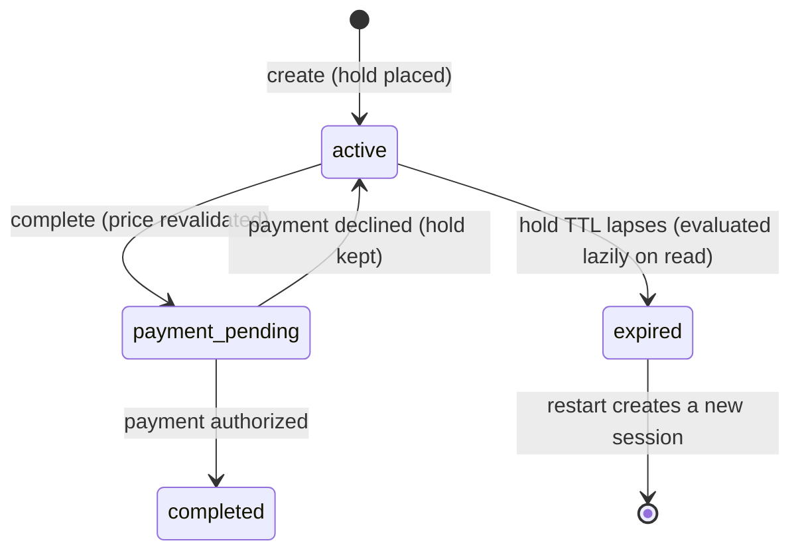

# Checkout Continuity

A prototype of cross-surface checkout for a time-sensitive ticket marketplace: a fan starts checkout on web, resumes it on mobile through a deep link (or the other way around), and the two surfaces stay honest with each other about inventory holds, price changes, in-flight payments, and completion. No duplicate orders, no stale holds, no silent price swaps.

Built with Next.js 16 (App Router, React 19.2), TypeScript, and an in-memory store per the assignment constraints.

## Run it

Requires Node 20.9+ (any recent LTS).

```bash
npm install
npm run dev        # http://localhost:3000
```

```bash
npm test                    # 16 state-transition tests (vitest)
node scripts/scenario.mjs   # scripted end-to-end walkthrough over HTTP (dev server must be running; resets demo data first, safe to re-run)
```

### Demo walkthrough (2 minutes)

1. On the home page, hit **Buy now**. That creates a checkout session and places a 5-minute inventory hold.
2. On the checkout page, click **Resume this session on mobile (deep link)**. It opens a phone-sized window; put it next to the desktop one. They are two surfaces sharing one backend session, each polling every 3 seconds.
3. In either window, use the demo controls: **price +$25** shows the price-change flow (the other surface picks it up within a poll, and Pay is blocked until the new price is explicitly accepted). **force expire** shows the expiry and restart flow.
4. Set payment to **slow success (4s)** and click Pay in one window, then immediately click Pay in the other. One completes; the other is told a payment is already in progress, and then converges on the same completed order. There is never a second charge.

The demo controls mutate real backend state through the same code paths that production events (marketplace repricing, hold lapse) would take, so what you see is the actual state machine, not scripted UI.

## The state model

The backend owns one source of truth per checkout: the session (`lib/types.ts`, `lib/checkout.ts`).



Two deliberate non-statuses:

- **Price change is a derived flag, not a status.** The session stores `acceptedPriceCents`, the per-ticket price the fan last saw and accepted. Every read compares it to the listing's current price; completion revalidates it at commit time and returns `409 PRICE_CHANGED` on mismatch. The invariant: money is never taken at a price the fan has not seen. A price change does not invalidate the hold, so it should not change the state.
- **Payment decline is not terminal.** The session returns to `active` with the error attached, because the fan's hold is still valid and retrying should be one tap.

Other properties of the model:

- **Expiry is a stored deadline, evaluated lazily on every read.** No timers. Every surface converges on the same answer whenever it asks, it survives restarts conceptually, and it is testable with fake clocks. A session that is mid-payment cannot expire; if the hold lapsed during a declined payment, expiry applies immediately after.
- **Inventory is a hold.** Creating a session moves quantity from available to held; completion converts held to sold; expiry releases it. A second fan genuinely sees SOLD_OUT while someone else holds the last seats.
- **Every mutation bumps `version`.** Clients re-render only when the version changes, and a cross-surface resume bumps it too, so the desktop page visibly learns "this session was just opened on mobile."

## What lives where

| Backend (source of truth) | Client (safe to hold) |
|---|---|
| Session status, hold deadline, accepted price, order, version | The session id (in the URL / deep link) |
| Listing price and inventory counts | Ephemeral UI state: ticking countdown between polls, button busy states |
| Analytics event log | A clock offset (server time minus local time) so the countdown cannot be fooled by a wrong device clock |

## API surface

| Route | Purpose |
|---|---|
| `POST /api/sessions` | Create a session for a listing (places the hold) |
| `GET /api/sessions/:id?surface=&resume=1` | Resume or poll; `resume=1` marks an explicit resume (deep link, page load, tab refocus) for analytics |
| `POST /api/sessions/:id/complete` | Attempt payment and finalize. Idempotent |
| `POST /api/sessions/:id/accept-price` | Explicitly accept the current listing price after a change |
| `POST /api/dev/simulate` | Demo levers: reprice a listing, force-expire a session |

All session responses are `Cache-Control: no-store`; checkout truth never comes from a cache. Error semantics follow HTTP meaning: stale price and concurrent payment are 409 (conflict, actionable), an expired hold is 410 (gone), and a duplicate completion is deliberately a 200 with `alreadyCompleted: true`, because idempotent success is not an error.

## How web and mobile resume the same session

The only thing a surface needs is the session id. The web checkout lives at `/checkout/:id`; the simulated mobile app opens `/m/checkout/:id`, standing in for the universal-link target of `gametime://checkout/:id`. Opening either counts as a resume on that surface: the backend records the surface, bumps the version, and the analytics log gains a `session_resumed` event with a `crossSurface` flag. Both surfaces poll the same GET every 3 seconds and re-render when the version moves, so a change made anywhere (price acceptance, payment, expiry) is visible everywhere within a poll. Returning to a backgrounded tab triggers an immediate resume poll, the web analog of an app coming to the foreground.

## How duplicate orders are prevented

Three independent layers, tested at both the service and HTTP levels:

1. **Idempotent completion.** Completing an already-completed session returns the existing order with `alreadyCompleted: true`. A retry or a second device can never create a second order.
2. **A completion lock.** The session flips to `payment_pending` synchronously before the payment call starts, so a concurrent complete from another device gets `409 PAYMENT_IN_PROGRESS` and its UI shows "payment in flight on another device" until it converges.
3. **Commit-time price revalidation.** A device holding a stale price cannot complete at it, regardless of what its UI shows.

Honest scope note: the lock in layer 2 is an event-loop mutex, which is airtight in this single-process prototype but not across multiple server instances. The production shape is a conditional write (`UPDATE ... SET status='payment_pending' WHERE id=? AND status='active'`, or Redis `SET NX`) plus an idempotency key on the payment call derived from the session id, so even a double-fired provider request cannot double-charge. The interfaces here are already shaped for that swap.

## Web performance: what appears before hydration

The checkout page is a React Server Component. The event, venue, seats, per-ticket price, total, session status, and the hold countdown are all rendered into the initial HTML on the server; no client fetch is needed for first paint. Hydration adds behavior only: polling, the ticking countdown, and button handlers. Verified by curling the page and finding all of that content, including `hold 5:00`, in the raw HTML response.

Two details worth calling out:

- The countdown ticks on the server clock via an offset captured at each poll, so a skewed device clock cannot misrepresent the hold.
- When the local countdown hits zero, the client does not declare expiry itself. It asks the server, which is the only judge of expiration.

## Instrumentation

Every transition emits an event (`session_created`, `session_resumed` with surface and `crossSurface`, `price_change_accepted`, `payment_started/declined`, `checkout_completed` with `crossSurface`, `session_expired`, `duplicate_complete_ignored`) into an in-memory log. The conversion question this answers: compare completion rate and time-to-complete for sessions that had a cross-surface resume against sessions that stayed on one surface, and measure where continuity saves an otherwise-lost checkout (resumed after a `session_expired` would have fired, completed after a price re-acceptance). In production these land in the analytics pipeline keyed by session id, which is shared across surfaces by construction.

## Tradeoffs

- **Polling over SSE/WebSockets.** 3-second polls of a no-store GET are robust, proxy-friendly, and close to how mobile apps actually refresh. Real-time push is the production upgrade; nothing in the model changes, only the transport.
- **One shared checkout island for both surfaces.** The surfaces differ in chrome (phone frame, deep-link banner), not logic, so the state machine cannot fork between web and mobile. The cost is less platform-specific UI nuance than a real app would have.
- **In-memory store, single process.** Per the assignment. The store is pinned to `globalThis` to survive dev-server hot reloads, and the comment in `lib/store.ts` records the production mapping (Redis/Postgres with a TTL index).
- **Quantity fixed at 2, no auth.** Cart mechanics and identity are orthogonal to continuity, so they are stubbed to keep the slice focused end to end.

## With more time

- Replace the event-loop completion lock with a conditional write and add payment idempotency keys, then run the race tests against two server instances.
- Push session updates over SSE with polling as fallback, and reconcile on `online`/`visibilitychange`.
- Hold-extension UX ("still there? your seats are held for 2 more minutes") and a grace window on expiry, which is a product decision the state machine already supports.
- Real deep links (universal links / app links) with deferred deep linking for the not-installed case.
- An analytics sink with a small funnel dashboard instead of an in-memory array.
- Accessibility pass: focus management when state panels swap, `aria-live` on status changes.

## AI usage

Per the assignment's note on AI tools: this project was built with Claude Code as the implementation partner, directed and reviewed by hand. How it was used and validated:

- **Where:** scaffolding, the domain layer, route handlers, UI components, tests, and this README were AI-drafted from my design direction; the state model semantics (what is a status vs. a derived flag, lock ordering, expiry rules) were decided in design discussion before code was written.
- **Why:** speed on boilerplate and breadth, so the limited time went to the state model, failure semantics, and verification instead of plumbing.
- **How outputs were validated and challenged:** every claim the code makes is backed by a mechanical check I ran: the 16-test vitest suite (including a two-device completion race asserting exactly one order, mid-payment expiry protection, malformed-input rejection, and hold release for abandoned sessions), the 10-step HTTP scenario script against the live server, and a curl of the checkout page proving the pre-hydration HTML contains the full checkout context. Self-review passes between stages caught real issues that were fixed before committing, including a cross-surface resume that mutated state without bumping the session version (so other surfaces would never have seen the handoff) and a countdown that originally trusted the client clock. Framework choices were verified against current releases rather than taken from the model's memory.
